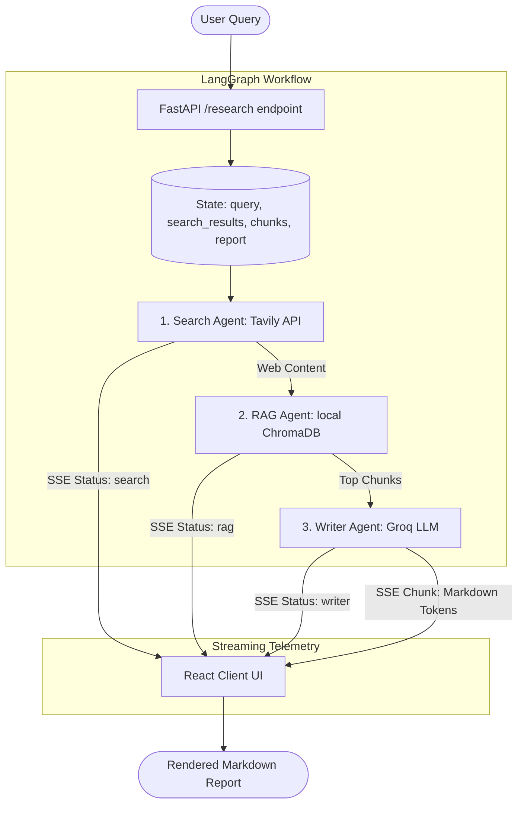

# InSightForge: Multi-Agent RAG Research Assistant

🚀 **Live Demo**: [https://research-os-nine.vercel.app](https://research-os-nine.vercel.app)

InSightForge is an AI-powered research platform that automates web searching, performs retrieval-augmented generation (RAG) using local vector embeddings, and generates source-cited markdown reports that stream in real time. 

Powered by a sequential **LangGraph** multi-agent workflow, **FastAPI** Server-Sent Events (SSE) streaming, and a responsive **React** glassmorphic interface.

---

## 🚀 Key Features

* **Sequential Multi-Agent Architecture**: Uses LangGraph to manage graph state across three specialized nodes (Search, RAG, Writer).
* **Real-time Event Streaming**: Utilizes FastAPI and Server-Sent Events (SSE) to stream token chunks and active agent status updates directly to the client.
* **Cost-Efficient Local Embeddings**: Embeds web contexts completely locally using `sentence-transformers` (`all-MiniLM-L6-v2`) and indexes them into a local `ChromaDB` vector database.
* **Accurate Source Citations**: Grounded synthesis prompts ensure the generated report includes inline markdown links referring back to the crawled web pages.
* **Premium Client Utilities**:
  * **Interactive status telemetry** tracking active agents.
  * **Persistent search history** saved to local storage for instant loading.
  * **Quick-start preset prompts** for testing.
  * **Export to Markdown** capability.

---

## 🛠️ Tech Stack

* **Frontend**: React, TypeScript, Vite, Vanilla CSS (Premium Glassmorphic Design), Lucide icons.
* **Backend**: FastAPI, LangGraph, LangChain, ChromaDB, Sentence-Transformers, Uvicorn, Python Dotenv.
* **APIs**:
  * **Tavily AI**: Optimized web search API for LLMs.
  * **Groq Cloud**: Lightning-fast inference engine running `llama-3.3-70b-versatile`.

---

## 🔄 System Architecture

---

