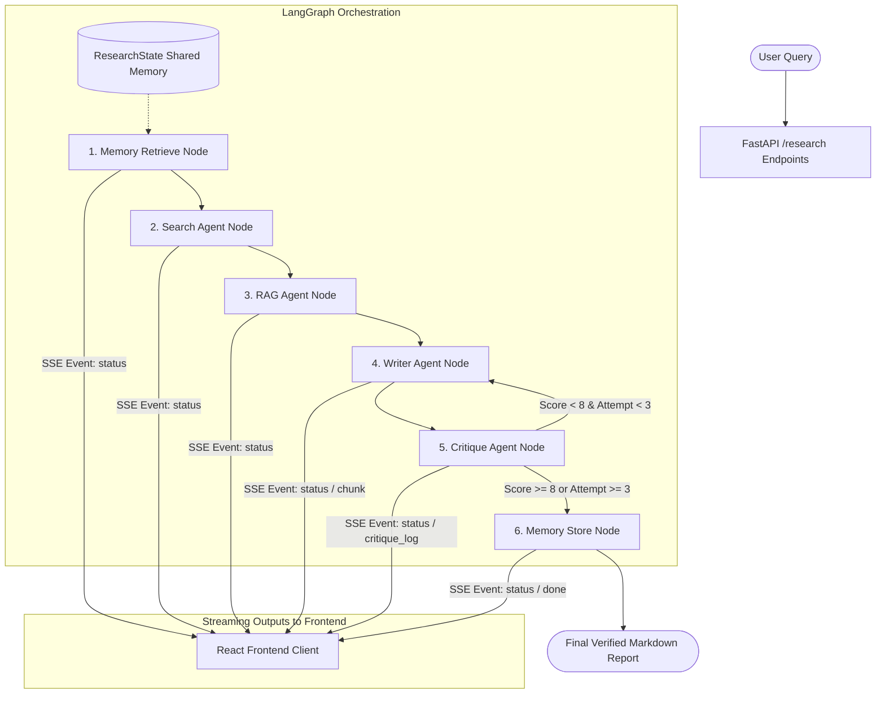

# InSightForge System Architecture & Workflow Guide

Welcome to the **InSightForge** System Architecture Guide. InSightForge is a state-of-the-art, self-correcting multi-agent research engine that retrieves memory, searches the web, fuses queries using dense/sparse RAG, synthesizes reports, evaluates them using LLM critiques, and stores findings in persistent memory.

This document provides a complete file-by-file breakdown of the system and details the data flow and orchestration.

---

## 🔄 Multi-Agent Workflow

InSightForge is orchestrated using a **LangGraph StateGraph**. Unlike traditional linear chains, the graph leverages **persistent state**, **cyclic loopbacks** for self-correction, and **conditional execution**.

### Graph Architecture

### Execution Flow Step-by-Step

1. **Memory Retrieve Node (`memory_retrieve`)**:
   - Queries a persistent ChromaDB database collection (`agent_memory`) to retrieve past query-report pairs matching the current query.
   - If relevant context is found, it adds it to the state to guide the report generation, optimizing resource use and search efficiency.

2. **Search Agent Node (`search`)**:
   - Triggers Tavily AI's web search API to crawl high-quality web data.
   - Operates in either **Basic** depth (max 5 results) or **Advanced** depth (max 10 results).
   - Saves raw content, page titles, and source URLs into the shared state.

3. **RAG Agent Node (`rag`)**:
   - Parses crawled web content, splits it into overlapping chunks, and embeds them locally using `SentenceTransformers` (`all-MiniLM-L6-v2`) in a session-isolated collection (`research_{session_id}`).
   - Executes a **dense semantic vector query** on ChromaDB and a **sparse keyword query** using BM25 (`rank-bm25`).
   - Merges findings using **Reciprocal Rank Fusion (RRF)** ($k=60$) to identify the top 3 most relevant source text fragments.
   - Cleans up database collections to isolate session data.

4. **Writer Agent Node (`writer`)**:
   - Formulates a detailed prompt consisting of the original query, RRF-fused chunks, and past memory context.
   - Calls Groq's `llama-3.3-70b-versatile` LLM with asynchronous streaming.
   - Emits SSE tokens representing raw markdown text directly to the client as they generate.

5. **Critique Agent Node (`critique`)**:
   - Evaluates the report drafted by the Writer Agent.
   - Scores the draft from 1 to 10 and writes structural feedback.
   - **Self-Correction Condition**: If the score is $< 8$ (e.g., due to missing citations, unsupported facts, or poor query alignment), the graph triggers a loopback to the `writer` node. The Writer Agent receives the feedback, increments the attempt counter, and drafts a corrected version.

6. **Memory Store Node (`memory_store`)**:
   - Executed once the report passes the critique score threshold ($\geq 8$) or reaches max revision attempts (3).
   - Embeds and saves the finalized report in the persistent `agent_memory` collection to enrich future queries.

---

## 📂 Backend Directory Structure & Files

The backend is built with **FastAPI** + **sse-starlette** for asynchronous SSE streaming, and **LangGraph** for multi-agent execution.

### 1. `backend/main.py`
- **Purpose**: Entry point of the server application.
- **Key Responsibilities**:
  - Sets up the FastAPI app instance, configures CORS policies, and runs the Uvicorn web server.
  - Defines the `/research` endpoint which initiates the LangGraph execution.
  - Utilizes `EventSourceResponse` (from `sse-starlette`) to establish a persistent HTTP connection to stream steps (`event: status`), critique loops (`event: critique_log`), markdown report blocks (`event: chunk`), and termination indicators (`event: done`).

### 2. `backend/state.py`
- **Purpose**: State definition for graph-wide shared memory.
- **Key Responsibilities**:
  - Defines `ResearchState` using TypedDict.
  - Fields include: `query` (input), `session_id` (isolation), `search_results` (raw search outputs), `retrieved_chunks` (RRF-fused context), `report` (compiled text), `memory_context` (past query histories), `critique_score`/`critique_feedback` (evaluations), `writer_attempts` (loop counter), and `current_agent` (active node tracker).

### 3. `backend/graph.py`
- **Purpose**: Defines the StateGraph workflow and conditional logic.
- **Key Responsibilities**:
  - Imports all agent nodes and constructs a `StateGraph(ResearchState)`.
  - Defines transition edges: `memory_retrieve` ➔ `search` ➔ `rag` ➔ `writer` ➔ `critique`.
  - Implements the conditional routing edge from the `critique` node: if `critique_score < 8` and `writer_attempts < 3`, routes back to `writer`. Otherwise, routes to `memory_store` ➔ `END`.

### 4. `backend/agents/memory_agent.py`
- **Purpose**: Persistent query context layer.
- **Key Responsibilities**:
  - `memory_retrieve_agent`: Queries the persistent ChromaDB collection `agent_memory`. If a previous search matches with high similarity, appends the past report as `memory_context` to guide the writer.
  - `memory_store_agent`: Commits the finalized query-report pairs into `agent_memory`.

### 5. `backend/agents/search_agent.py`
- **Purpose**: High-speed internet search.
- **Key Responsibilities**:
  - Integrates `TavilyClient`.
  - Queries search keywords, parses organic result sets, filters URL links, and writes parsed metadata into `search_results`.

### 6. `backend/agents/rag_agent.py`
- **Purpose**: Hybrid Search & Reciprocal Rank Fusion.
- **Key Responsibilities**:
  - Implements character-sliding chunking (`chunk_text`).
  - Manages session-specific ChromaDB collections to prevent concurrency conflicts.
  - Conducts parallel search: dense semantic query via ChromaDB, sparse tokenized keyword query via BM25 (`rank-bm25`).
  - Merges rankings using the Reciprocal Rank Fusion (RRF) algorithm:
    $$RRF\_score = \sum_{m \in M} \frac{1}{rank_m + 60}$$
  - Returns the top 3 fused context chunks.

### 7. `backend/agents/writer_agent.py`
- **Purpose**: Professional markdown synthesizer.
- **Key Responsibilities**:
  - Formulates prompt payloads specifying strict guidelines (such as inline markdown citations in `[Source Title](URL)` format).
  - Uses Groq Cloud LLM to write report sections.

### 8. `backend/agents/critique_agent.py`
- **Purpose**: Self-correcting auditor.
- **Key Responsibilities**:
  - Audits the report draft for factuality, query alignment, and proper inline citations.
  - Outputs a structured JSON containing a score (1-10) and feedback text.

---

## 📂 Frontend Directory Structure & Files

The frontend is a modern **React + Vite** single-page application built on a custom Obsidian-Peach skin-toned glassmorphism UI.

### 1. `frontend/index.html`
- **Purpose**: Main HTML entry template.
- **Key Responsibilities**:
  - Embeds Google Fonts (`Inter`, `Outfit`, `JetBrains Mono`).
  - Integrates full SEO tags: title tag, description meta tag, keywords, robot crawls, canonical link, Open Graph tags, and Twitter Cards.

### 2. `frontend/src/main.tsx`
- **Purpose**: Client application mounting point.
- **Key Responsibilities**:
  - Binds the React root element to `#root` in the HTML page.

### 3. `frontend/src/App.tsx`
- **Purpose**: Main UI container and state hub.
- **Key Responsibilities**:
  - Manages comparison toggle states (`compareMode`).
  - Initiates streaming sessions. In **Compare Mode**, launches concurrent stream processes (Basic vs. Advanced depth) and renders side-by-side views.
  - Persists query results and metadata histories to `localStorage`.

### 4. `frontend/src/index.css`
- **Purpose**: Global style guidelines.
- **Key Responsibilities**:
  - Defines variables (creamy peach `#ebd8d0`, apricot `#dd9b7e`, deep dark espresso `#0a0807`).
  - Implements glassmorphism panels, loading state animations, custom scrollbars, and React Flow overlay styles (translucent nodes, hidden default connectors).

### 5. `frontend/src/api/research.ts`
- **Purpose**: Streams event-handler helper.
- **Key Responsibilities**:
  - Establishes persistent `EventSource` tunnels to `/research`.
  - Dispatches message handlers depending on event headers: `status`, `chunk`, `critique_log`, `done`, or `error`.

### 6. `frontend/src/components/SearchBar.tsx`
- **Purpose**: Input controls container.
- **Key Responsibilities**:
  - Dictation button leveraging the browser's native **Web Speech API** for hands-free query creation.
  - Depth buttons (Basic/Advanced toggle) and Compare Depth check boxes, all mapped with unique IDs for automated tests.

### 7. `frontend/src/components/AgentStatus.tsx`
- **Purpose**: Interactive node-graph visualization canvas.
- **Key Responsibilities**:
  - Renders a node diagram of the LangGraph layout using **React Flow**.
  - Renders custom glassmorphism nodes with Lucide symbols, changing border colors depending on node status (active apricot pulse, completed emerald green, pending translucent).
  - Employs Bezier lines between Critique and Writer nodes that animate when active, visualizing the self-correcting critique loop.
  - Displays critique evaluation feedback logs.

### 8. `frontend/src/components/ReportStream.tsx`
- **Purpose**: Renders single-stream reports.
- **Key Responsibilities**:
  - Uses `react-markdown` to format streaming report text in real time.
  - Includes a copy-to-clipboard button and action indicators.

### 9. `frontend/src/components/ReportComparison.tsx`
- **Purpose**: Side-by-side comparison dashboard.
- **Key Responsibilities**:
  - Displays Basic vs. Advanced reports side-by-side.
  - Features a metric comparing word counts, unique citation rates, and search depth variables.

---

## 🚀 Advanced RAG & Multi-Agent Technologies

1. **Dense + Sparse Hybrid RAG**:
   - Semantic dense retrieval is perfect for thematic associations, while BM25 sparse retrieval is crucial for exact keyword matching (like function names or specific terminology).
   - Reciprocal Rank Fusion (RRF) ensures the most relevant pages rise to the top regardless of search style.

2. **Self-Correction (Orchestrated Revisions)**:
   - Evaluator critique scoring is modeled as a routing conditional loop. The Critique Agent checks if the report is factually grounded and properly cited.
   - If the score is $< 8$, the critique feedback is injected back into the writer's state, and the Writer Agent generates a corrected version in a cyclic loop.

3. **Side-by-Side Dual-Stream Comparison**:
   - Executes concurrent server-side events streams. The React app handles parallel events concurrently and plots comparison stats in real-time, proving highly performant.
